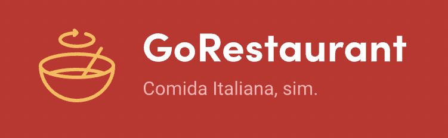
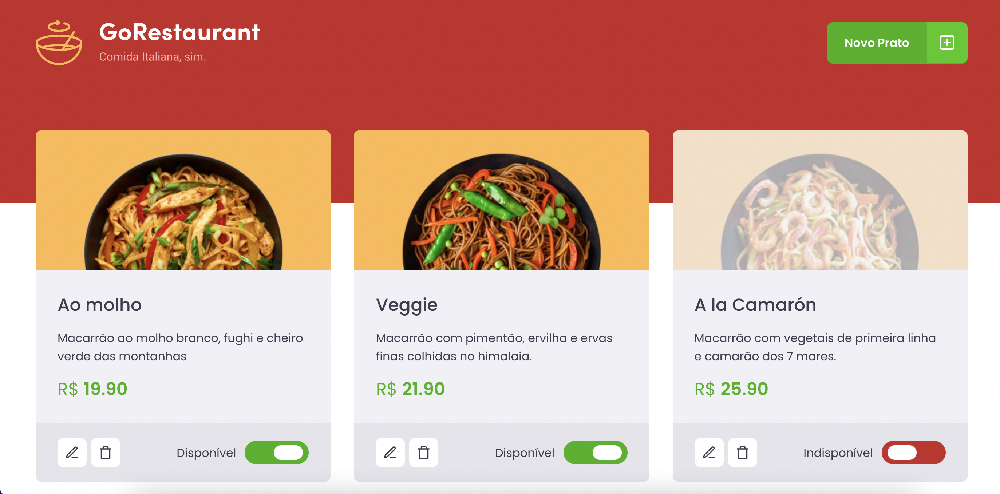

<h1 align="center">
  
</h1>

 

  

## 🚀 Tecnologias

Esse projeto foi desenvolvido com as seguintes tecnologias:

- HTML
- CSS
- JavaScript
- TypeScript
- NodeJS
- ReactJS
- JSON server

## 💻 Projeto

Os desafios nesse projeto foram a migração de Javascript para TypeScript e de Class Components para Function Components.
Esse projeto foi o quarto desafio do Ignite ReactJS da Rocketseat.